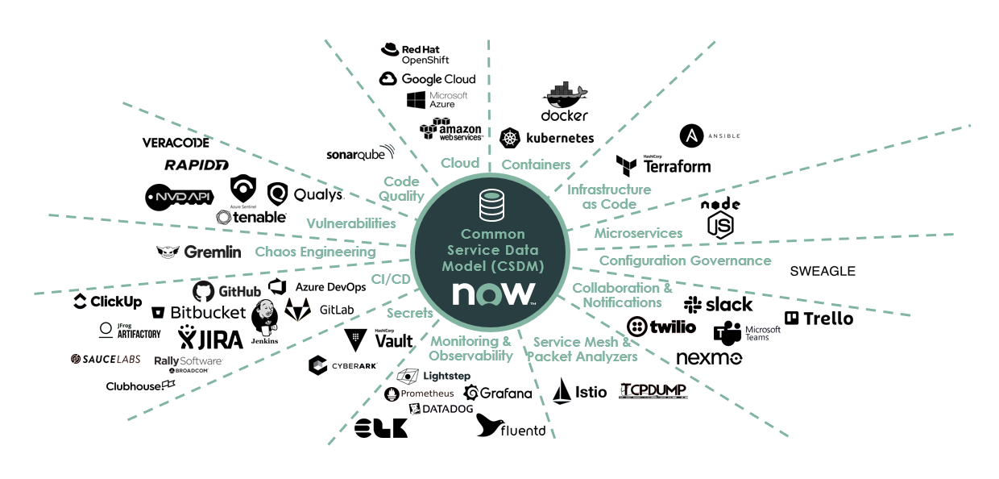

Here you can find a curated collection of ServiceNow Solutions which you can follow and implement at your own pace in your own enviroment. The Solutions are grouped by common Cloud Native IT   Industry Use-Cases and consist of documents, diagrams and code. Just browse through the Catalog or Search for topics of interest.

