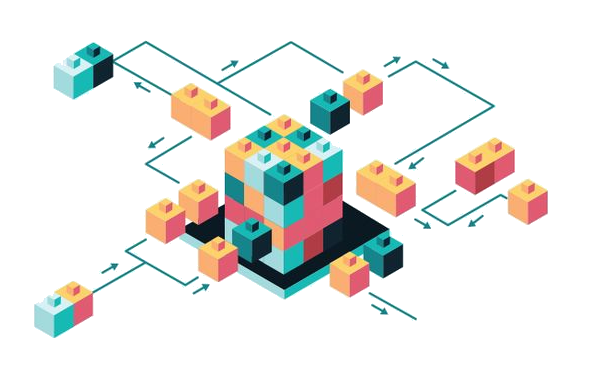

A Reference Architecture is a document or set of documents that provides recommended structures and integrations of IT products and services to form a Solution. Here you can find a curated collection of ServiceNow Reference Architectures which you can follow and implement at your own pace in your own enviroment. Reference Architectures consist of Architecture Diagrams, Documentation and Code and are grouped by common IT industry Use-Cases. Just browse through the Catalog or Search for topics of interest.

