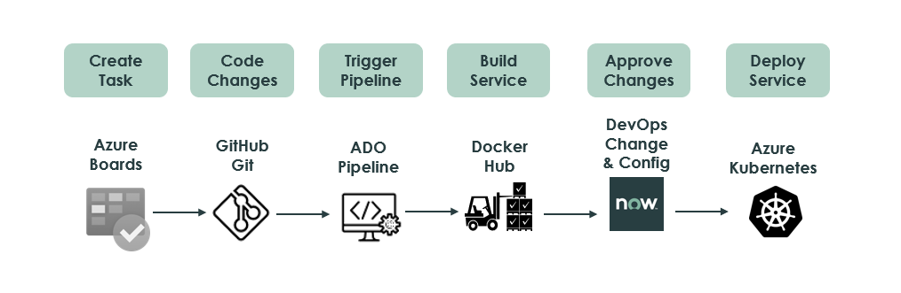

Bridge the gap between distributed DevOps/SRE teams and centralized ServiceNow platform owner teams by automatically generating Change Requests. Utilize data from your existing CI/CD tools against sophisticated change policies to accelerate your pipeline.

# Dataflow

1. Create a *Work Item* in `Azure Boards` and note the *Work Item ID* (e.g. AB#14) and assign the item to a developer.
1. Make your *code* and *configuration changes* and commit your changes to `GitHub`.

    > NOTE: Makes sure to set the commit message to the `Work Item ID` relating the code change to the `Azure Boards` work item.

1. Trigger the `ADO Pipeline` to start the build and deployment of your changes. 
1. Service is built and the Docker image is published to `Docker Hub` ready for final deployment.
1. The `ADO Pipeline` pauses, and a Change Request is *automatically generated* in ServiceNow for approval.
1. The `Change Request` is reviewed in ServiceNow and approved after reviewing all the changes.
1. The `ADO Pipline` is released and the Docker image is deployed to the `Azure Kubernetes` environment 

